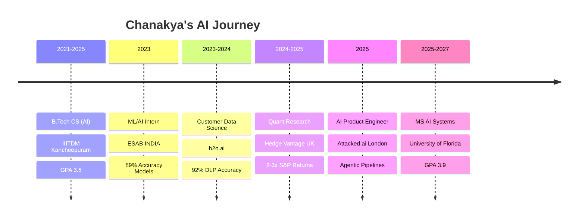

# 
🚀 Chanakya Vasantha 🚀

  

  

##  About Me

- 🎓 **MS in AI Systems** @ University of Florida (GPA: 3.9)
- 🔬 **Graduate Research Assistant** developing adaptive LLM evaluators
- 🏆 **Smart India Hackathon 2023 Winner** (1st among 250K participants)
- 📈 Built trading models with **2-3× S&P 500 returns**
- 🤖 Specialized in **Agentic AI**, **Quant Research**, and **Computer Vision**
- 🌟 **IEEE COMSNETS 2025** published researcher

 

  

##  Tech Stack & Skills

### 🧠 AI/ML & Data Science

### 💻 Programming & Frameworks

### ☁️ Cloud & DevOps

  

##  Featured Projects

| 🚀 **Project** | 🛠️ **Tech Stack** | 📊 **Impact** | 🔗 **Links** |
|---|---|---|---|
| **🧠 Adaptive LLM Evaluator** | `LiveKit` `OpenAI` `3D Models` | Educational Assessment Revolution | [🔗](#) |
| **🛡️ Agentic AI Security Pipeline** | `LLMs` `Knowledge Graphs` `Django` | Real-time Threat Intelligence | [🔗](#) |
| **📈 GDP Forecasting System** | `Prophet` `Scikit-learn` | 0.05% Forecast Error | [🔗](#) |
| **🚗 EV Fleet Optimization** | `Simulated Annealing` `Greedy Algorithms` | IEEE Published Research | [🔗](#) |
| **👁️ Fundus Image Quality Assessment** | `ResNet50` `Computer Vision` | 86.2% Medical Accuracy | [🔗](#) |

  

##  GitHub Analytics

  

  

  

  

##  Professional Journey

  

##  Achievements & Recognition

| 🏆 **Achievement** | 📅 **Year** | 🎯 **Impact** |
|---|---|---|
| 🥇 **Smart India Hackathon Winner** | 2023 | 1st among 250,000 participants |
| 📚 **IEEE COMSNETS 2025 Publication** | 2025 | EV Fleet Optimization Research |
| 🎪 **Responsible AI Conference Speaker** | 2024 | LLaMA2 Jailbreaking Awareness |
| 👨‍💼 **Tech Lead & AI Wing Founder** | 2023-2025 | 250+ participants impact |
| 📈 **Quantitative Trading Success** | 2024 | 2-3× market returns |

  

##  Connect With Me

  

---

  

  <i>⭐ "Building the future, one algorithm at a time" ⭐</i>

